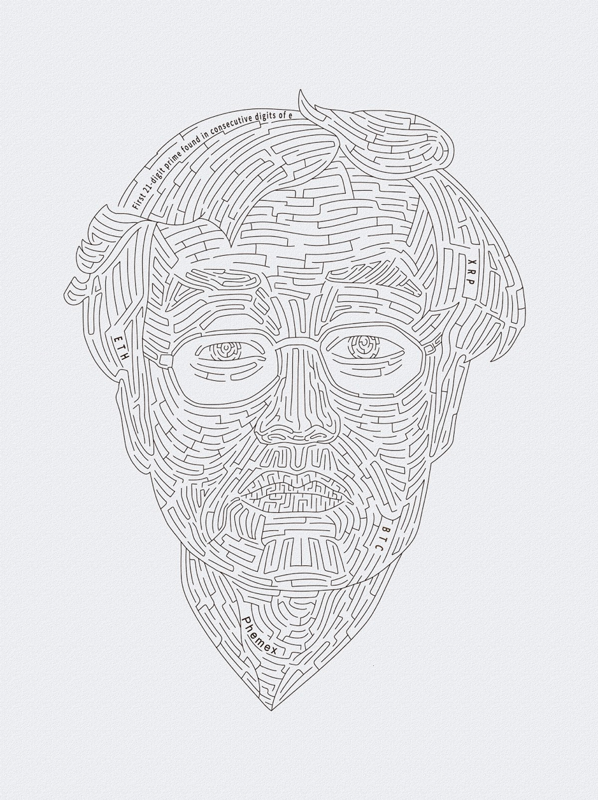

# Phemex "Puzzle"

An attempt to solve the phemex puzzle for a prize of 2.1 BTC

- [Summary](#summary)
- [Official articles](#official-articles)

## Summary

- Address is [1h8BNZkhsPiu6EKazP19WkGxDw3jHf9aT](https://live.blockcypher.com/btc/address/1h8BNZkhsPiu6EKazP19WkGxDw3jHf9aT/)
- The compressed public key is `02b4a72e4aaa69ba04b80c6891df01f50d191a65eccc61e4e9862d1e421ce815b3`
- 21 digit prime is `957496696762772407663`
- Some words from the image need to be converted into a 27-digit decimal number
- Puzzle is solvable without hints
- Capitalization of words in puzzle matters
- 27-digit number is not necessarily a prime
- 27-digit number doesn't involve consecutive digits of `e`

## Official articles

- [Puzzle announcement article - January 16, 2020](https://phemex.com/references/articles/try-to-solve-our-2-btc-puzzle#the-public-key-is-1h8bnzkhspiu6ekazp19wkgxdw3jhf9at)
  - 2.1 BTC are hidden in this picture, can you find the solution?
  - Once a participant has found the correct private key in the image, they will be able to transfer 1.1 BTC to the public key address of their own wallet. A further 1 BTC will be deposited to their Phemex account once they prove they control the private key.
 
- [A letter from Max (27 digit clue) - January 23, 2020](https://phemex.com/references/articles/a-letter-from-max)
  - The first 21-digit prime found in consecutive digits of e is: `957496696762772407663`
  - The private key you derive from Satoshi’s portrait is a big integer, not Wallet Import Format (WIF)
  - _The filename of the picture is irrelevant_ :unamused:
  - The next step involves converting some words from the portrait, without I/O, into a 27-digit number
  - Go back to step 4) again if you can’t figure it out
    
- [The Last Hint of Phemex 2.1BTC Puzzle - February 21, 2020](https://phemex.com/references/articles/the-last-hint-of-phemex-2-1btc-puzzle)
  - After meeting the Phemex team, the Goddess Pheme repeated the words “little is big”, twice within three days.

- [The "solution" - March 21, 2020](https://phemex.com/references/articles/puzzle-ending)
  - The first 21-digit prime found in consecutive digits of e is: `957496696762772407663`
  - 27-digit number: `237871847045914904726285415` (first hint came out on Jan. 23, two times within three days)
    - `b58decode('SatoshiNakamoto')` - Convert the bytes to integer using little endian, which is bigger than that of big endian
    - `Charset (BTC): '123456789ABCDEFGHJKLMNPQRSTUVWXYZabcdefghijkmnopqrstuvwxyz'`
    - **I do find some people try to convert ‘SatoshiNakamoto’ in telegram chat, so don’t blame me that they are not ‘some words from the portrait’**
  - Last number: `554405551875`
    - `b58decode(‘Phemex’)`- Convert the bytes to integer using little endian, which is also bigger than that of big endian
    - `Charset (XRP): 'rpshnaf39wBUDNEGHJKLM4PQRST7VWXYZ2bcdeCg65jkm8oFqi1tuvAxyz'`